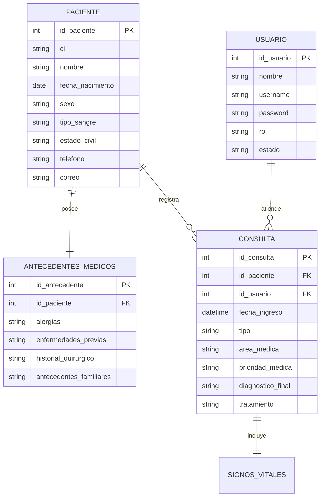
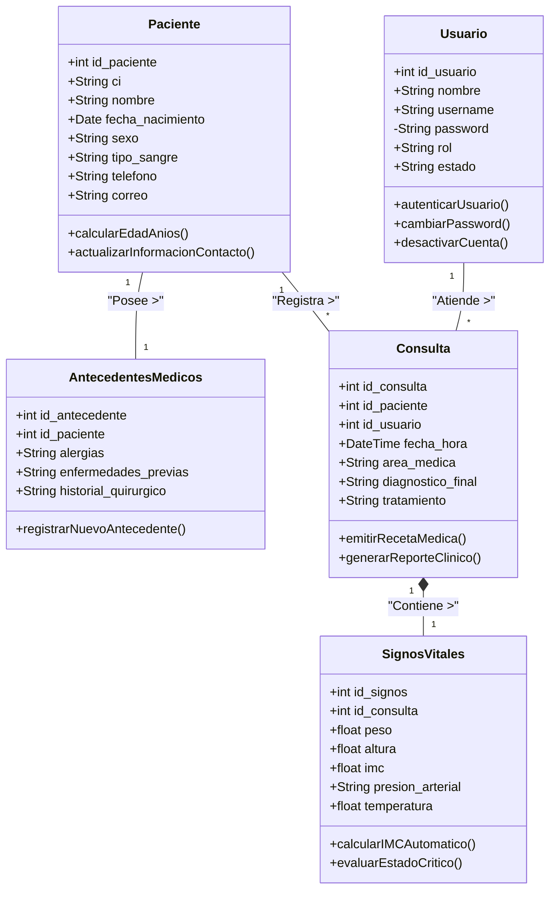

# Documento de Diseño Estructurado de Base de Datos
## Sistema de Gestión de Pacientes - Clínica Gran Potosí

**Materia:** INF760 - Diseño Estructurado de Base de Datos  
**Actividad:** Guía de Actividad 5  

---

## 1. Introducción y Objetivos del Diseño

El presente documento expone el análisis y diseño estructurado de la base de datos relacional para el **Sistema de Gestión de Pacientes de la Clínica Gran Potosí**. El objetivo principal es establecer una arquitectura de datos robusta, normalizada y escalable que soporte los requerimientos funcionales del sistema, garantizando la integridad, seguridad y disponibilidad de la información médica.

### Objetivos Específicos:
- Eliminar la redundancia de datos mediante la aplicación de formas normales (hasta 3FN).
- Mantener un registro histórico inmutable de las consultas clínicas.
- Separar la información demográfica del paciente de sus antecedentes médicos y signos vitales volátiles.
- Establecer un control de acceso estricto a través de roles de usuario.

---

## 2. Reglas de Negocio Identificadas

A partir de los requerimientos de la clínica y las interfaces del sistema, se han definido las siguientes reglas:
1. **Unicidad de Paciente:** Un paciente se identifica unívocamente por su Carnet de Identidad (CI). No pueden existir dos pacientes con el mismo CI.
2. **Historial Inmutable:** Una vez registrada una consulta médica, sus datos diagnósticos y de tratamiento no deben borrarse, garantizando la trazabilidad médico-legal.
3. **Roles de Usuario:** Solo los usuarios con rol de "Médico" pueden emitir diagnósticos y tratamientos. Los "Administradores" gestionan los accesos.
4. **Normalización de Antecedentes:** Los antecedentes médicos (alergias, enfermedades previas, historial quirúrgico) se gestionan por separado para optimizar la consulta de la tabla principal de pacientes.
5. **Signos Vitales:** Los signos vitales (presión, IMC, peso, etc.) se asocian directamente a una *Consulta* específica, ya que representan el estado del paciente en un momento temporal exacto, no un atributo estático del paciente.

---

## 3. Modelo Entidad-Relación (E-R)

El modelo conceptual identifica 5 entidades principales. Se ha ampliado el diseño original separando los antecedentes médicos y signos vitales para un modelado mucho más profesional.

### Entidades y Relaciones:
- **PACIENTE:** Datos demográficos y de contacto.
- **ANTECEDENTES_MEDICOS:** Historial clínico base del paciente (Alergias, cirugías, enfermedades previas). Relación 1:1 con PACIENTE.
- **USUARIO:** Personal que opera el sistema (Médicos, Enfermeras, Administradores).
- **CONSULTA:** Evento transaccional. Un PACIENTE tiene muchas CONSULTAS (1:N). Un USUARIO (Médico) atiende muchas CONSULTAS (1:N).
- **SIGNOS_VITALES:** Parámetros físicos medidos durante una consulta. Relación 1:1 con CONSULTA.

### Diagrama E-R (Esquema Conceptual)

---

## 4. Modelo Relacional (Normalización a 3FN)

En esta fase técnica, las entidades conceptuales se transforman en tablas relacionales, definiendo claves primarias (PK) y foráneas (FK) para mantener la integridad referencial.

**Tabla: USUARIO**
`id_usuario (PK)` | `nombre` | `username` | `password` | `rol` | `estado`

**Tabla: PACIENTE**
`id_paciente (PK)` | `ci` | `nombre` | `fecha_nacimiento` | `sexo` | `tipo_sangre` | `estado_civil` | `ciudad` | `direccion` | `telefono` | `correo` | `contacto_emergencia` | `estado`

**Tabla: ANTECEDENTES_MEDICOS** *(Relación 1:1 con Paciente)*
`id_antecedente (PK)` | `id_paciente (FK)` | `alergias` | `enfermedades_previas` | `medicamentos_actuales` | `antecedentes_familiares` | `historial_quirurgico` | `observaciones_generales`

**Tabla: CONSULTA** *(Tabla Transaccional / Puente entre Paciente y Usuario)*
`id_consulta (PK)` | `id_paciente (FK)` | `id_usuario (FK)` | `fecha_hora` | `tipo_consulta` | `area_medica` | `prioridad_medica` | `sintomas_observados` | `diagnostico_preliminar` | `diagnostico_final` | `tratamiento` | `indicaciones_medicas`

**Tabla: SIGNOS_VITALES** *(Relación 1:1 con Consulta)*
`id_signos (PK)` | `id_consulta (FK)` | `peso` | `altura` | `imc` | `presion_arterial` | `frecuencia_cardiaca` | `temperatura` | `saturacion_oxigeno`

---

## 5. Diagrama de Clases (Mapeo Objeto-Relacional)

El siguiente diagrama UML orienta el diseño relacional hacia el paradigma orientado a objetos, fundamental para el desarrollo del backend (ej. uso de un ORM como Prisma o TypeORM). Se detallan los atributos encapsulados y los métodos principales de la lógica de negocio.

---

## 6. Diccionario de Datos Ampliado

A continuación se documenta a nivel técnico cada columna del esquema, garantizando que el equipo de base de datos comprenda el dominio y restricciones de cada campo.

### 6.1. Tabla: USUARIO
Almacena las credenciales y perfiles del personal médico y administrativo.
| Columna | Tipo de dato | Nulos | PK/FK | Restricción / Dominio | Descripción |
| :--- | :--- | :--- | :--- | :--- | :--- |
| `id_usuario` | INT | NO | PK | Auto-incremental | Identificador único del usuario |
| `nombre` | VARCHAR(100) | NO | - | - | Nombre completo del profesional |
| `username` | VARCHAR(50) | NO | - | UNIQUE | Nombre de usuario para el login |
| `password` | VARCHAR(255) | NO | - | Hash bcrypt | Contraseña encriptada por seguridad |
| `rol` | VARCHAR(30) | NO | - | ('Administrador', 'Médico', 'Enfermería', 'Recepcionista') | Nivel de privilegio y acceso en el sistema |
| `estado` | VARCHAR(20) | NO | - | ('Activo', 'Inactivo') | Controla si el usuario puede loguearse |

### 6.2. Tabla: PACIENTE
Almacena exclusivamente los datos demográficos, evitando mezclar historial médico.
| Columna | Tipo de dato | Nulos | PK/FK | Restricción / Dominio | Descripción |
| :--- | :--- | :--- | :--- | :--- | :--- |
| `id_paciente` | INT | NO | PK | Auto-incremental | ID único del paciente |
| `ci` | VARCHAR(15) | NO | - | UNIQUE | Carnet de Identidad o Pasaporte |
| `nombre` | VARCHAR(100) | NO | - | LENGTH > 5 | Nombre completo del paciente |
| `fecha_nacimiento`| DATE | NO | - | <= CURRENT_DATE | Para calcular la edad dinámicamente |
| `sexo` | CHAR(1) | NO | - | ('M', 'F', 'O') | Sexo biológico |
| `tipo_sangre` | VARCHAR(5) | SI | - | ('A+', 'A-', 'B+', 'B-', 'AB+', 'AB-', 'O+', 'O-') | Grupo sanguíneo |
| `estado_civil` | VARCHAR(20) | SI | - | ('Soltero', 'Casado', 'Viudo', 'Divorciado') | Estado civil del paciente |
| `ciudad` | VARCHAR(50) | SI | - | Default 'Potosí' | Ciudad de residencia |
| `direccion` | VARCHAR(150) | NO | - | - | Dirección exacta de domicilio |
| `telefono` | VARCHAR(15) | NO | - | 7-10 dígitos | Teléfono principal de contacto |
| `correo` | VARCHAR(100) | SI | - | Formato Email | Correo electrónico |
| `contacto_emergencia` | VARCHAR(100)| SI | - | - | Nombre y teléfono para emergencias |

### 6.3. Tabla: ANTECEDENTES_MEDICOS
Separación en 3FN de los antecedentes genéricos e históricos que no cambian en cada consulta.
| Columna | Tipo de dato | Nulos | PK/FK | Restricción / Dominio | Descripción |
| :--- | :--- | :--- | :--- | :--- | :--- |
| `id_antecedente` | INT | NO | PK | Auto-incremental | ID único de registro |
| `id_paciente` | INT | NO | FK | UNIQUE, REF(PACIENTE) | Paciente al que pertenecen (Rel. 1 a 1) |
| `alergias` | TEXT | SI | - | Default 'Ninguna' | Alergias a medicamentos, alimentos, etc. |
| `enfermedades_previas`| TEXT | SI | - | - | Historial de enfermedades crónicas |
| `medicamentos_actuales`| TEXT | SI | - | - | Tratamientos de base que toma habitualmente |
| `antecedentes_familiares`| TEXT| SI | - | - | Patologías hereditarias relevantes |
| `historial_quirurgico` | TEXT | SI | - | - | Cirugías previas y fechas aproximadas |
| `observaciones_generales`| TEXT| SI | - | - | Notas permanentes en la portada del expediente |

### 6.4. Tabla: CONSULTA
El corazón transaccional del sistema. Une a un médico con un paciente en un momento del tiempo.
| Columna | Tipo de dato | Nulos | PK/FK | Restricción / Dominio | Descripción |
| :--- | :--- | :--- | :--- | :--- | :--- |
| `id_consulta` | INT | NO | PK | Auto-incremental | ID único de consulta |
| `id_paciente` | INT | NO | FK | REF(PACIENTE) | Paciente que recibe la atención médica |
| `id_usuario` | INT | NO | FK | REF(USUARIO) | Profesional que realiza la atención |
| `fecha_hora` | DATETIME | NO | - | Default CURRENT_TIMESTAMP | Momento exacto del ingreso/atención |
| `tipo_consulta` | VARCHAR(50) | NO | - | ('Primera Vez', 'Reevaluación', 'Emergencia', 'Rutina') | Modalidad de la consulta |
| `area_medica` | VARCHAR(80) | NO | - | Ej. 'Pediatría', 'Cardiología', 'Medicina General' | Especialidad de la atención |
| `prioridad_medica`| VARCHAR(20) | NO | - | ('Baja', 'Media', 'Alta', 'Crítica') | Nivel de urgencia (Triage) |
| `sintomas_observados` | TEXT | SI | - | - | Motivo de consulta referido por el paciente |
| `diagnostico_preliminar`| TEXT | SI | - | - | Hipótesis diagnóstica inicial |
| `diagnostico_final` | TEXT | NO | - | - | Conclusión clínica definitiva |
| `tratamiento` | TEXT | SI | - | - | Receta médica farmacológica |
| `indicaciones_medicas`| TEXT | SI | - | - | Cuidados, reposo, o exámenes solicitados |

### 6.5. Tabla: SIGNOS_VITALES
Registro de la evaluación física puntual del paciente en una consulta específica.
| Columna | Tipo de dato | Nulos | PK/FK | Restricción / Dominio | Descripción |
| :--- | :--- | :--- | :--- | :--- | :--- |
| `id_signos` | INT | NO | PK | Auto-incremental | ID del registro de signos |
| `id_consulta` | INT | NO | FK | UNIQUE, REF(CONSULTA) | Dependencia temporal (Rel. 1 a 1) |
| `peso` | DECIMAL(5,2)| SI | - | > 0 | Peso corporal medido en Kilogramos |
| `altura` | DECIMAL(3,2)| SI | - | > 0 | Estatura medida en Metros |
| `imc` | DECIMAL(4,2)| SI | - | > 0 | Índice de Masa Corporal (Calculado) |
| `presion_arterial`| VARCHAR(10) | SI | - | Formato 'Sistólica/Diastólica' (Ej. 120/80) | Tensión arterial en mmHg |
| `frecuencia_cardiaca`| INT | SI | - | > 0 | Latidos por minuto (lpm) |
| `temperatura` | DECIMAL(3,1)| SI | - | Rango lógico (30.0 a 45.0) | Temperatura corporal en Grados Celsius |
| `saturacion_oxigeno`| INT | SI | - | Rango (0 a 100) | Porcentaje de SpO2 |

---
*Este diseño estructurado asegura el cumplimiento del principio ACID en bases de datos y sienta una base sólida para el desarrollo backend del Sistema de Gestión Clínica.*
